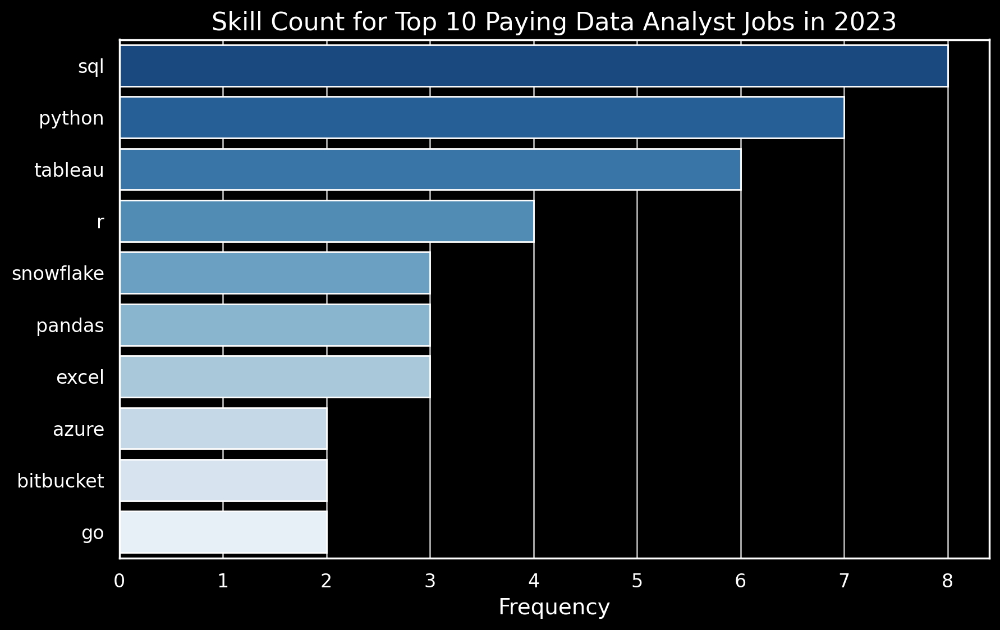

# Data Analyst Job Market Analysis with SQL

## Introduction

I built this project to analyze the Data Analyst job market using SQL, with a focus on three things:

- Which Data Analyst roles offer the highest salaries?
- Which skills are most frequently requested by employers?
- Which skills appear to combine strong demand with higher average salaries?

The goal was not only to practice SQL syntax, but to use SQL to answer practical questions that someone entering the Data Analytics field might actually ask when deciding which skills to develop.

The analysis focuses on **2023 Data Analyst job postings**, including remote opportunities and salary information where available.

📁 **SQL queries:** [`project_sql/`](project_sql/)

---

# Background

As I transition into Data Analytics, one of the questions I wanted to answer was:

> **Which technical skills are actually valuable in the Data Analyst job market?**

Instead of relying only on course recommendations or general advice, I used job-posting data to investigate the relationship between **job demand, required skills, and salary**.

This project also gave me an opportunity to practice working with relational datasets and writing SQL queries that answer business-oriented questions.

### Questions I wanted to answer

1. What are the highest-paying Data Analyst jobs?
2. What skills are required for the highest-paying roles?
3. Which skills are most frequently requested for Data Analyst positions?
4. Which skills are associated with higher average salaries?
5. Which skills appear to provide a strong combination of demand and salary?

---

# Tools & Technologies

### SQL

Used SQL as the primary analytical tool to filter, join, aggregate, and analyze job-posting data.

### PostgreSQL

Used PostgreSQL to query the relational job-market database.

### Visual Studio Code

Used VS Code to write and execute SQL queries and organize the project files.

### Git & GitHub

Used Git for version control and GitHub to document and publish the project.

---

# Analysis

## 1. Highest-Paying Data Analyst Jobs

I started by identifying the highest-paying Data Analyst positions among remote job postings with available annual salary information.

The query joins job postings with company information and sorts the available roles by annual salary.

The analysis identified a wide range of salaries among the top-paying roles, with the highest listed salary reaching **$650,000**.

### Key observations

- The top 10 roles ranged from approximately **$184,000 to $650,000** in annual salary.
- The companies represented included organizations such as **SmartAsset, Meta, and AT&T**.
- The job titles varied considerably, ranging from traditional Data Analyst positions to more senior or specialized analytics roles.

This suggests that the Data Analyst title can cover a broad range of responsibilities and compensation levels.

_Top 10 highest-paying Data Analyst roles identified from the dataset._

---

## 2. Skills Appearing in the Highest-Paying Jobs

Next, I wanted to understand what technical skills appeared in these high-paying positions.

I joined the highest-paying job postings with the associated skills tables and counted the skills attached to those roles.

### Key findings

Among the top 10 highest-paying roles:

| Skill   | Number of Jobs |
| ------- | -------------: |
| SQL     |              8 |
| Python  |              7 |
| Tableau |              6 |

Other skills appearing in these postings included:

- R
- Snowflake
- Pandas
- Excel

### What this tells me

SQL appeared in most of the highest-paying roles in this small sample, followed by Python and Tableau.

This does **not** mean that these skills alone cause higher salaries. Rather, they were frequently present in the job requirements of these particular high-paying positions.

_Skills found across the top 10 highest-paying Data Analyst roles._

---

# 3. Most In-Demand Data Analyst Skills

I then expanded the analysis from the highest-paying positions to the broader set of remote Data Analyst job postings.

The objective was to identify which skills employers requested most frequently.

### Top 5 skills

| Skill    | Demand Count |
| -------- | -----------: |
| SQL      |        7,291 |
| Excel    |        4,611 |
| Python   |        4,330 |
| Tableau  |        3,745 |
| Power BI |        2,609 |

### Key takeaway

SQL stood out as the most frequently requested skill in the dataset, followed by Excel and Python.

Visualization and Business Intelligence tools were also strongly represented, particularly Tableau and Power BI.

For me personally, this finding reinforced the decision to prioritize **SQL first** in my Data Analyst learning path, followed by Power BI and Excel.

_Source: Data Analyst job postings in the project dataset._

---

# 4. Skills Associated with Higher Average Salaries

Demand alone does not tell the whole story, so I also investigated the average salary associated with different skills.

The analysis calculated the average annual salary for remote Data Analyst positions associated with each skill.

Some of the highest averages in the resulting list were associated with specialized technologies such as:

| Skill         | Average Salary |
| ------------- | -------------: |
| PySpark       |       $208,172 |
| Bitbucket     |       $189,155 |
| Couchbase     |       $160,515 |
| Watson        |       $160,515 |
| DataRobot     |       $155,486 |
| GitLab        |       $154,500 |
| Swift         |       $153,750 |
| Jupyter       |       $152,777 |
| Pandas        |       $151,821 |
| Elasticsearch |       $145,000 |

### Important interpretation

These results should be interpreted carefully.

A high average salary associated with a skill does **not** necessarily mean that learning that skill will directly result in a higher salary.

Many of these technologies are associated with more specialized analytics, engineering, machine learning, or data-platform roles.

The analysis is therefore more useful as an indication of **which technologies appear in higher-compensation job postings**, rather than as a salary guarantee for individual analysts.

---

# 5. Skills Combining Demand and Salary

Finally, I wanted to look at skills from both perspectives:

**How frequently does the skill appear?**

and

**What is the average salary of jobs requiring it?**

I filtered out skills with fewer than 10 associated job postings and compared their demand counts with average salaries.

Some examples from the analysis included:

| Skill      | Demand Count | Average Salary |
| ---------- | -----------: | -------------: |
| Go         |           27 |       $115,320 |
| Confluence |           11 |       $114,210 |
| Hadoop     |           22 |       $113,193 |
| Snowflake  |           37 |       $112,948 |
| Azure      |           34 |       $111,225 |
| BigQuery   |           13 |       $109,654 |
| AWS        |           32 |       $108,317 |
| Java       |           17 |       $106,906 |
| SSIS       |           12 |       $106,683 |
| Jira       |           20 |       $104,918 |

The broader analysis also showed substantial demand for Python and R, while technologies such as Snowflake, Azure, AWS, BigQuery, Tableau, and Looker appeared to combine meaningful demand with relatively high average salaries.

---

# What I Learned

This project was my first structured SQL analysis focused on a real-world business question rather than isolated SQL exercises.

### 1. SQL is more than syntax

Writing queries became much more useful when I started with a question first and then worked backwards to determine what data and SQL logic were needed.

### 2. Relational data requires careful joins

Working across job postings, companies, and skills required joining multiple tables and understanding how the tables were related.

### 3. Aggregation is essential for analysis

`GROUP BY`, `COUNT()`, and `AVG()` were central to turning thousands of individual job-posting records into information that could actually be interpreted.

### 4. CTEs make complex analysis easier to structure

Using `WITH` clauses helped separate intermediate calculations from the final analysis and made more complicated queries easier to reason about.

### 5. Data needs context before conclusions

One of the biggest lessons from this project was that a correlation between a skill and salary should not automatically be interpreted as causation.

For example, a specialized technology may appear alongside higher salaries because it is commonly required in more senior or specialized roles.

---

# Key Takeaways

Based on this dataset, several patterns stood out:

### SQL was highly prominent

SQL appeared frequently across both the broader Data Analyst job market and the highest-paying sample.

### Excel remained highly relevant

Excel ranked second in overall skill demand, reinforcing that traditional spreadsheet analysis remains important alongside newer analytics tools.

### Python was also strongly represented

Python appeared frequently in job postings and was present across several high-paying positions.

### BI and visualization tools matter

Tableau and Power BI both appeared prominently in the demand analysis, highlighting the importance of communicating analytical results visually.

### Specialized technologies appeared alongside higher salaries

Cloud, data engineering, and specialized analytics technologies were associated with higher average salaries in parts of the dataset. However, these results should not be interpreted as a direct salary guarantee.

---

# Conclusion

This project helped me move from learning individual SQL commands toward using SQL as an analytical tool.

The analysis also gave me a more evidence-based perspective on the skills I should prioritize as I transition into Data Analytics.

Based on the results, my immediate focus is on building a strong foundation in:

**SQL → Power BI → Excel → Python**

Rather than trying to learn every technology appearing in the highest-paying jobs, I want to first become highly competent in the core tools that appear consistently across Data Analyst opportunities.

The next step is to take what I learned from this guided SQL project and apply it to **an original, independently defined portfolio project** where I develop the business questions, analysis, and conclusions myself.
